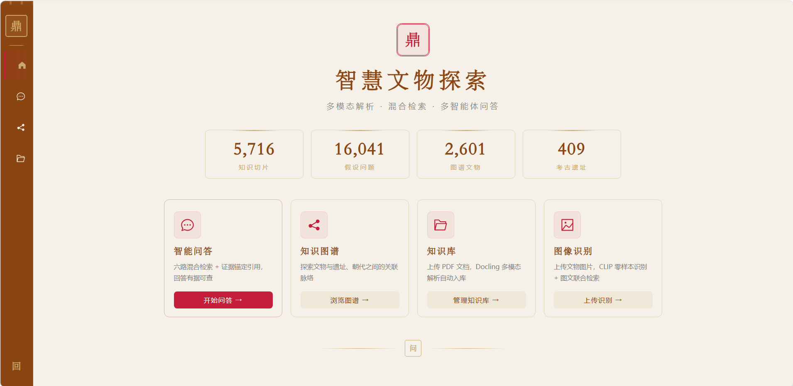
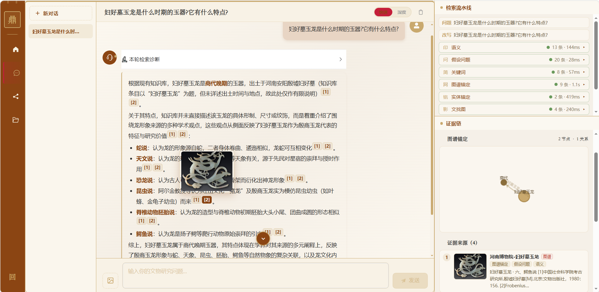
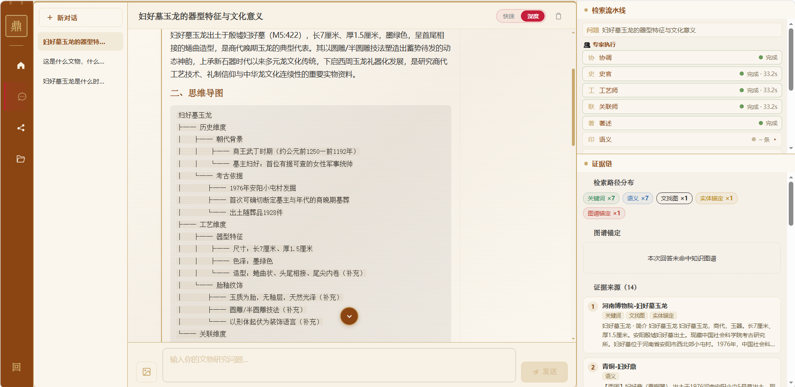
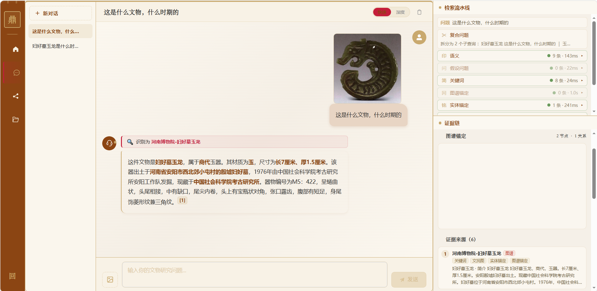

# DocuMind · 智慧文物探索

> 面向中国文物的**多模态 RAG 智能问答系统**——给文物爱好者与研究者:拍照识物、问文物、看图谱,回答带证据、可溯源、图文并茂。

[](https://www.python.org)
[](https://fastapi.tiangolo.com)
[](https://vuejs.org)
[](https://neo4j.com)
[](LICENSE)

## 目录

- [核心功能](#核心功能)
- [演示](#演示)
- [它解决什么问题](#它解决什么问题)
- [核心设计决策](#核心设计决策)
- [系统架构](#系统架构)
- [项目结构](#项目结构)
- [快速开始](#快速开始)
- [数据重建](#数据重建配置)
- [技术栈](#技术栈)
- [未来规划](#未来规划)
- [免责声明与许可](#免责声明与许可)

## 核心功能

- 💬 **快速问答** — 六路混合检索 + 证据锚定生成,回答携带 `[1][2]` 引用徽章,点击直达证据原文,图文并排对照(如「妇好墓玉龙是什么时期的玉器?」→ 商代、玉器、尺寸、出土信息带引用)
- 🔍 **深度研究** — 史官 / 工艺 / 关联三专家**并行**分析,著述 Agent 融合出带思维导图的综合研究报告
- 📷 **拍照识物** — 上传文物照片,CLIP 图-图余弦在 9468 张图索引上零样本识别(无需训练),置信度门控防幻觉,识别-检索一体
- 🕸 **知识图谱** — 2601 件文物 / 409 遗址 / 11 朝代 / 4 窑口的 Neo4j 图谱,ECharts 交互式展开,图谱问答模板化查询
- 📄 **文档入库** — 上传 PDF 异步解析入库(结构感知切分 + 图片抽取 + VLM 图注),秒级可检索,支持替换重传
- 📊 **全链路可观测** — 每次检索六路命中数与耗时实时流式推送诊断面板,jsonl 落盘可回溯

## 演示

> 以下均为知识库内**真实文物数据与图片**(文本 / 图谱 / 图片三态齐全)的运行截图。

### 首页 —— 系统总览



### 快速问答 —— 六路检索 + 引用溯源

> 提问:「妇好墓玉龙是什么时期的玉器?它有什么特点?」



### 深度研究 —— 三专家并行 + 思维导图

> 提问:「妇好墓玉龙的器型特征与文化意义」



### 拍照识物 —— CLIP 零样本识别

> 上传妇好墓玉龙照片 + 提问:「这是什么文物?」



## 它解决什么问题

**1. 长尾文物知识,通用 RAG 召回差。** 文物是典型的"长尾领域"——同一个器物,用户会问年代、纹饰、工艺、出土、馆藏、文化意义,泛化问答模型对这类冷门实体经常答非所问、甚至编造。难点在于:知识分散在爬取文本、结构化字段、图片图注、图谱关系四种形态里,单一检索路无法覆盖。**所以**做六路混合召回 + 加权 RRF 融合,让每一形态的知识都有独立通道被捞起,再统一融合排序。

**2. 图文分离,"看图说话"弱。** 文物问题天然要看图(器型、纹饰、釉色),但传统 RAG 只索引文本。难点:图片没有自然语言内容,如何进检索?**所以**引入 CLIP 图文同空间编码——图片块(图注级)与文本块同库共存参与融合,CLIP 图找图零样本识别,文找图作为独立检索路;图片证据链随回答返回,图文对照。

**3. 用户问法与库内陈述句的语义鸿沟。** 库内是"妇好墓玉龙,商代,玉器,长7厘米…"的陈述句,用户问"这是什么时期的?"——embedding 距离远,BM25 靠关键词偶合。难点:查询侧增强(如 HyDE)增加延迟与成本。**所以**在**入库侧**为每个 chunk 预生成 3 条假设问题,构建 16152 条问题索引,Q-to-Q 匹配,查询侧零额外延迟。

## 核心设计决策(速查)

| 环节 | 关键决策 | 为什么 |
|---|---|---|
| 文档入库 | 结构感知切片(子块精确/父块兜语境)+ 实体/问题索引一次成型 | PDF 非结构化,文物图录天然"条目化",按结构切 |
| 查询理解 | 改写 → 意图路由 → CRAG 评估闭环,不足重检索、再不足拒答 | 口语化/复合问法;答错不如拒答,不编造 |
| 六路召回 | 语义(树剪枝)+ 问题索引 + 图谱锚定 + CLIP 图文,BM25/实体兜底 | 知识分散在文本/字段/图注/图谱四种形态 |
| 问题索引 | 入库侧**对着答案生成问题**(Q-to-Q) | HyDE 用 LLM 猜答案查库,长尾下"猜错→查不准"循环 |
| 融合排序 | 加权 RRF(k=60),权重网格实验定标(重叠 0.5 / 视觉 0.1 / 图注 0.3) | 排名投票天然抑噪;防同源双计与视觉噪声挤占 |
| 上下文净化 | RRF 分数两簇天然分界(0.025)裁剪弱块 | 多路票与单路票分数簇间有空隙,可观测 |
| 生成 | 证据块全局编号锚定 + 识别名强约束注入 | 引用可溯源不幻觉;vision 只围绕识别文物作答 |
| 可靠性 | 模板化 Cypher 防注入 + 图谱宕机 60s 冷却降级 + 启动预热 | 外部依赖故障被隔离,首问不被模型加载阻塞 |

## 系统架构

```
  文档入库 ──► Chroma(文本/图片块 + 实体 + 问题索引) ──┐
  文本问题 ──► 查询理解(改写 → 意图路由 → CRAG 评估) ──┼──► 混合召回
  文物照片 ──► CLIP 识别(图找图,识别名驱动检索) ──────┘      │
                                                             ▼
                                   加权 RRF 融合 → 噪声过滤 → 证据链
                                                             │
                                                             ▼
                                   证据锚定生成 → NDJSON 流式
                                  (内容 / 引用溯源 / 轨迹 / 思维导图)
                                                             │
                                                             ▼
                                   前端:流式聊天 · 引用联动 · 诊断面板
```

## 项目结构

```
frontend/                          Vue 3 单页应用
  src/
    views/                         首页 · 问答 · 知识图谱 · 文库
    components/                    证据面板 · 思维导图 · 流水线诊断
    stores/                        Pinia 状态(chat / knowledge / app)
backend/
  src/
    core/                          配置 · DI 组合根 · 查询轨迹 · 预热
    interfaces/                    6 个跨域抽象接口(可插拔)
    retrieval/                     六路召回 · RRF · 树剪枝 · 噪声过滤
    conversation/                 问答域(四层):编排 · 深度研究 · 多轮记忆
    graph/                         图谱域(四层):模板化 Cypher T1-T6
    multimodal/                    CLIP 图文互检 · 图片证据链 · 资产门面
    ingestion/                     入库域(四层):PDF 管道 · 统一 ingest CLI
    documents/                     文档管理:上传任务 · 指纹索引
  scripts/                         数据重建脚本(入库 / 索引)
demo/                              README 演示截图
```

## 快速开始

### 1. 启动后端(端口 5172)

```bash
cd backend
cp .env.example .env          # 必填 DEEPSEEK_API_KEY;Neo4j/百炼可选,缺省自动降级
uv sync
uv run python src/main.py
```

启动后看到 `════ 全部加载完成,可以开始提问 ════` 即可提问(约 1.5 分钟预热)。

本地模型(BGE / CLIP / reranker)从 ModelScope 缓存加载,默认路径见 `backend/src/core/config.py`,可用环境变量覆盖。

### 2. 启动前端(端口 5173)

```bash
cd frontend
pnpm install
pnpm dev
```

浏览器访问 `http://localhost:5173`。

### 3. 可选:Neo4j 知识图谱

未启动时图谱问答与图谱探索不可用,其余功能不受影响。

## 数据集

| 数据源 | 内容 | 规模 |
|---|---|---|
| 河南博物院官网「文物品鉴」 | 鉴赏文本(时代 / 纹饰 / 工艺 / 历史背景) | 283 篇 |
| 河南博物院官网配图 | 图片 + 图注(图注级图片块入库,检索可精确到张) | 282 个器物 / 144 个含图注 |
| 青铜器数据集(公开) | 结构化字段(名称 / 时期 / 出土地 / 尺寸)+ 图片 | 2248 件 / 3697 张 |
| 瓷器数据集(公开) | 图录 Excel(窑口 / 器物 / 鉴赏)+ 图片 | 70 个分类目录 |
| 用户上传 PDF | 运行时数据(异步解析入库,支持替换重传) | 按需 |

> 知识库总量:9600+ 文本/图片块 · 16152 条假设问题 · 9079 张图索引 · 2601 件文物 / 409 遗址 / 11 朝代 / 4 窑口(图谱)。数据集目录经环境变量配置(`BRONZE_DATASET_DIR` / `PORCELAIN_DATASET_DIR`)。

## 数据重建(配置)

运行数据(chroma 向量库 / 数据集图片 / 爬取文本 / 上传文档 / 日志)均**不入库**,克隆后按依赖顺序重建:

```bash
cd backend
# ① 数据集图片落盘 + 映射表(数据集目录经环境变量配置)
#    BRONZE_DATASET_DIR / PORCELAIN_DATASET_DIR,默认 datasets/bronze、datasets/porcelain
uv run python scripts/import_dataset_images.py --source bronze
uv run python scripts/import_dataset_images.py --source porcelain
uv run python scripts/import_dataset_images.py --source henan

# ② 文本/图片块入 Chroma
uv run python scripts/import_bronze_chroma.py
uv run python scripts/import_porcelain_chroma.py
uv run python scripts/import_henan_chroma.py
uv run python scripts/import_henan_image_chunks.py

# ③ 索引:CLIP 图片索引 + 假设性问题索引
uv run python scripts/import_clip_images.py
uv run python scripts/generate_questions.py

# ④ 知识图谱(需 Neo4j 运行中)
uv run python scripts/import_bronze_neo4j.py
uv run python scripts/import_porcelain_neo4j.py
uv run python scripts/import_henan_neo4j.py
```

> 河南博物院文本与图注数据(爬虫脚本不随仓库分发)需自行获取后放入 `backend/src/data/`,再执行 ② 中对应脚本。上传 PDF 走统一入库管道 `python -m ingestion --source X`(含结构感知切分与问题生成)。

## 技术栈

| 层 | 技术 |
|---|---|
| 前端 | Vue 3 · Vite · TypeScript · Pinia · Less · ECharts · Mind Elixir |
| 后端 | Python · FastAPI · Pydantic · uvicorn · DDD 四层 + DI 组合根 |
| 向量检索 | ChromaDB · BGE-small-zh-v1.5 · BM25(jieba + rank_bm25) |
| 知识图谱 | Neo4j · neomodel ODM |
| 多模态 | Chinese-CLIP(图文互检)· Qwen-VL(图注)· Docling(PDF 解析) |
| LLM | DeepSeek(NDJSON 流式)|

## 未来规划

- [ ] 更多数据源接入统一 ingest 管道(契约校验已就绪,新源即插即用)
- [ ] reranker 在更大显存环境复评(消费级 4GB 已证不可外推)
- [ ] 多轮记忆增强(现为 LRU 摘要,可升级分层记忆)
- [ ] 评测集扩充与自动化回归(检索改动自动跑契约)
- [ ] Agent 能力扩展:工具调用、多模态 Agent 协作
- [ ] **最终愿景:文物知识开放平台**——把"拍照即问"沉淀为面向公众的文物数字服务

## 免责声明与许可

- 知识库内容来自河南博物院官网公开栏目与公开文物数据集,**仅供学习与技术演示**,不代表官方结论;商用请自行核实数据来源与授权。
- 本项目采用 **MIT License**,详见 [LICENSE](LICENSE)。
